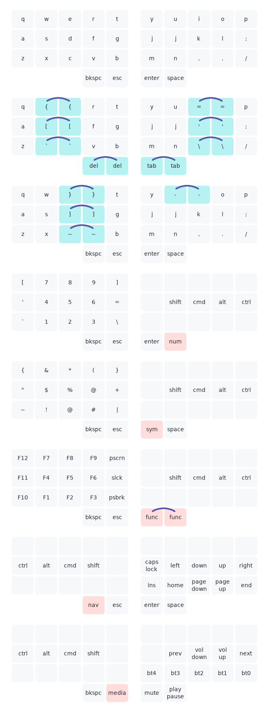

# Keymap
Adapting [@callum-oakley/keymap](https://github.com/callum-oakley/keymap) for my keymaps.

Legend:
- Keys joined by a short arc are combos, accessed by pressing both keys at once
- Red keys are held to access layers or modifiers

## [34-key](https://github.com/BrokenFlows/zmk-brokenflows/blob/master/config/zaphod.keymap)

## [46-key](https://github.com/BrokenFlows/zmk-brokenflows/blob/master/config/ishka.keymap)

